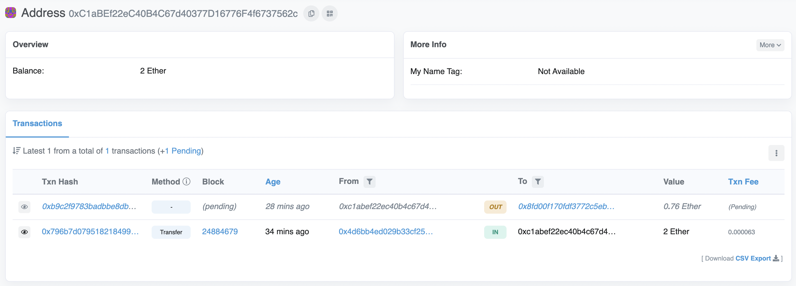
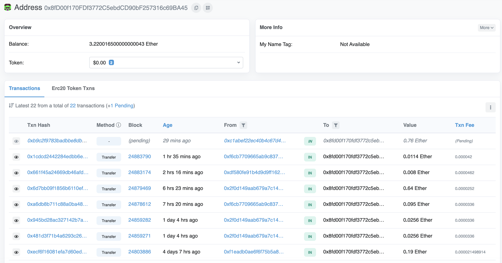

# FinTech Finder Cryptocurrency Wallet


---

## Technologies


Before attempting to execute any _Python_ code in `credit_risk_resampling.ipynb`, it is imperative that your development environment holds the following modules:

[os](https://docs.python.org/3/library/os.html) - Operating system module. 

[requests](https://docs.python-requests.org/en/master/index.html) - HTTP module.

[dotenv](https://pypi.org/project/python-dotenv/) - `.env` file module. 

[bip44](https://pypi.org/project/bip44/) - Python-based deterministic wallet module. 

[web3](https://web3py.readthedocs.io/en/stable/) - Module for Ethereum interaction via Python.

[dataclasses](https://docs.python.org/3/library/dataclasses.html) - Data class decorator module.

[typing](https://docs.python.org/3/library/typing.html) - Support for type hints module.

[streamlit](https://streamlit.io/) - Script-to-web application library.

---

## Installation Guide

With your _Python 3.7+_ environment, run the following commands via CLI:

```
pip install web3==5.17
pip install eth-tester
pip install mnemonic
pip install bip44
```

---

## Transaction Verification

The following section shows the results of a successful Ethereum wallet transaction. For our example transaction, we compensated _Jo_ for four hours. 

### Current Address Balance



### Transaction Details


### Recipient's Address Balance 



---

## Usage

1. Clone repository onto your personal machine. 

2. Within your _Python 3.7+_ environment, navigate to the directory in which the `fintech_finder.py` file from this repository is located. 

3. Run the following command to launch the web application:

```
streamlit run fintech_finder.py
```

---

## Contributors

New development created by Aaron C. Montano. **Code from 'Initial commit.' commit originates from UC Berkeley Extension and I do not claim original ownership nor scholarship**.

---

## License

Software tool available for public use. 
